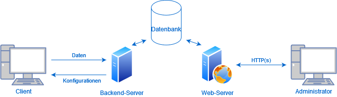
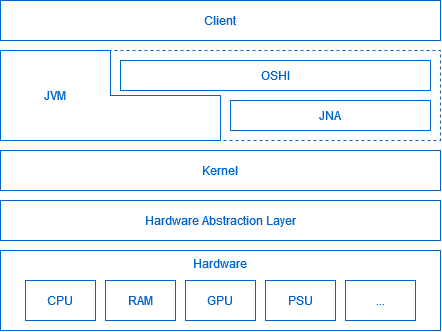

# Task Monitor
## Inhaltsverzeichnis
1. [Grundaufbau](#basicstructure)
2. [Client](#client)
   1. [OSHI](#client_ohsi)
   2. [Informationen](#client_information)
3. [Grundablauf Client-Server](#basicflow_client_server)

## 1. Grundlegendes 
Der Task Monitor besteht aus drei Hauptkomponenten
- Client
- Server
- Web-Server

Zusätzlich wird noch eine Datenbank benötigt, in der alle nötigen Informationen abgespeichert werden können.

Hierzu liest der Client in regelmäßigen Abständen Informationen aus und sendet diese an den Server,
der die Informationen in die Datenbank schreibt. Der Web-Server zeigt die in der Datenbank gespeicherten Daten dann
grafisch aufbereitet als http(s) server an. Des Weiteren soll der Server Daten filtern und diese unter gewissen Umständen 
(z.B. hohe CPU oder RAM Auslastung) als kritisch markieren. Sollten bei einem Client in einer gewissen Zeit
viele kritische Daten erkannt werden, wird der gesamte Client als kritisch angezeigt.

## 2. Client
Der Client bekommt über zwei Arten Informationen
1. JVM (Java Standard Bibliotheken) und
2. OSHI

### i. [OSHI](https://github.com/oshi/oshi)
OSHI steht für Operating System and Hardware Information, es ist eine API die auf [Java Native Access (JNA)](https://github.com/java-native-access/jna) basiert.
Die API unterstützt
- macOS,
- Linux,
- Windows,
- Solaris,
- FreeBSD
- OpenBSD,
- WindowsCE,
- AIX,
- Android,
- GNU,
- kFreeBSD und
- NetBSD.

Dabei wendet die API unter anderem JNA an, um eigene native Methoden in Java einzufügen.
Dies bedeutet, dass die Informationen direkt auf Betriebssystem-Ebene Abgefragt werden,
was zum einen den nachteil hat, dass die API Betriebssystem abhängig ist, jedoch auch den Vorteil,
dass die Einschränkungen der JVM umgangen werden können und es somit möglich ist mehr Daten abzufragen.
Einige Informationen werden jedoch auch ohne JNA durch JVM Standards (Dateien lesen, ENV-Abfragen, ...) bereitgestellt.

### ii. Informationen

  
Allgemeine Informationen

Allgemeine Informationen sind Information, die sich wären des laufenden Betriebes nicht oder selten ändern.
Diese beinhalten:
- Hostname
- Mainboard
  - Hersteller
  - Model
  - Hardware UID
- Firmware/BIOS
  - Name
  - Version
  - Hersteller
  - Veröffentlichungsdatum
- CPU
  - Kennung
    - Hersteller
    - Name
    - Famille
    - Model
    - Stepping
    - Prozessor Id
    - 64 Bit
    - Mikroarchitektur
  - Frequenz
  - Kerne
  - Threads
- Hauptspeicher
  - Kapazität
  - Page Anzahl
  - Swap Kapazität
  - Virtuelle Kapazität
  - Physisch (je Stick)
    - Steckplatz
    - Kapazität
    - Frequenz
    - Hersteller
    - Typ
- Sekundärspeicher (je Festplatte)
  - Name
  - Model
  - Kapazität
  - Partition (je Partition auf Festplatte)
    - Identifikation
    - Typ
    - UUID
    - Kapazität
    - Einbindepunkt
- GPU (je GPU)
  - Name
  - Hersteller
  - VRam
- Netzwerkschnittstellen (je Schnittstelle inkl. lokale)
  - Name
  - Anzeigename
  - Schnittstellenalias
  - Maximal Übertragungseinheit
  - Mac Adresse
  - IPv4 Adressen (je Adresse)
    - Adresse
    - Subnetmask
  - IPv6 Adresse (je Adresse)
    - Adresse
    - Prefix
  - Geschwindigkeit
- Netzteile (je Netzteil)
  - Name
- Soundkarten
  - Name
  - Codec
- USB-Geräte
  - Name
  - Hersteller
  - ProduktId
  - SerialId
  - Angeschlossene USB-Geräte (je Gerät, USB-Gerät)
- Betriebssystem
  - Familie
  - Hersteller
  - Version
  - Codec
  - Buildnummer 
- Internet
  - DNS (je Eintrag)
  - IPv4 Standartgateway
  - IPv6 Standartgateway
- Filesystem
  - Maximale Anzahl Datei Deskriptoren
  - Dateispeicher (je Dateispeicher)
    - Name 
    - Volumen
    - Lable
    - Mount
    - Beschreibung
    - Typ
    - Kapazität
- Benutzer (je angemeldetem Benutzer) (möglich, Administrator rechte?)
  - Name
  - Host
  - Terminal
  - Loginzeit

  
Laufende Informationen

Laufende Informationen sind Information, die sich wären des Betriebes laufend ändern.
Zu jeder Information über eine Komponent wird noch eine Id hinzugefügt, über die eine eindeutige zuteilung möglich ist.
Diese beinhalten:
- CPU
  - Auslastung
  - Kontextänderungen
  - Unterbrechungen
  - Temperatur
- Hauptspeicher
  - Benutzt
  - Swap Benutzt
  - Virtuell Benutzt
  - Page In
  - Page Out
- Sekundärspeicher (je Festplatte)
  - Warteschlangenlänge
  - Leseoperationen
  - Gelesene Bytes
  - Schreiboperationen
  - Geschriebene Bytes
  - Übertragungszeit
- Netzwerkschnittstellen (je Schnittstelle inkl. lokale)
  - Empfangene Bytes
  - Gesendete Bytes
  - Empfangene Pakete
  - Gesendete Pakete
  - Eingehende Fehler
  - Ausgehente Fehler
  - Kollisionen
- Betriebssystem
  - Prozesse
  - Threads
  - Betriebszeit
- Prozesse
  - ID
  - Name
  - Pfad
  - Befehl
  - Argumente
  - Umgebungsvariablen
  - Arbeitsverzeichnis
  - Benutzer
  - Benutzer ID
  - Gruppe
  - Gruppen ID
  - Status
  - Elternprozess ID
  - Priorität
  - Virtuelle Größe
  - Resistente Größe
  - CPU Zeit
  - Benutzer Zeit
  - Startzeit
  - Gelesen bytes
  - Geschrieben bytes
  - Geöffnete Dateien
  - Kumulierte Prozessorlast
  - Kleine Fehler
  - Große Fehler
  - Kontext änderungen
  - Threads
  - Threads (je benutzen Thread)
    - ID
    - Name
    - Status
    - Kumulierte Prozessorlast
    - Beginnende Hauptspeicheradresse
    - Kontext änderungen
    - Kleine Fehler
    - Große Fehler
    - CPU Zeit
    - Benutzer Zeit
    - Startzeit
    - Priorität
- Services
  - Prozess ID
  - Name
  - Status
- Fenster (nur GUI Betriebssysteme)
  - ID
  - Title
  - Command
  - Position
    - x
    - y
    - Höhe
    - Breite
  - Prozess
  - Anordnung
  - Sichtbar
- Internet
  - Stats
    - TCPv4/6
      - Aufgebaute Verbindungen
      - Aktive Verbindungen
      - Passive Verbindungen
      - Verbindungsfehler
      - Zurückgesetzte Verbindungen
      - Gesendete Segmente
      - Erhaltene Segmente
      - Erneut gesendete Segmente
      - Ausgehente Zurücksetzungen
      - Eingehende Fehler
    - UPDv4/6
      - Datagrame gesendet
      - Datagrame erhalten
      - Datagrame ohne Port
      - Fehlerhafte erhaltene Datagrame
  - Verbindungen (je offener TCP Verbindung)
    - Typ
    - lokale Adresse
    - lokaler Port
    - fremde Adresse
    - fremder Port
    - Status
    - Sendewarteschlange
    - Empfangswarteschlange
    - Besitzender Prozess
- Filesystem
  - Derzeitige Anzahl Datei Deskriptoren
  - Dateispeicher (je Dateispeicher)
    - Freie Kapazität
    - Benutzbare Kapazität

## 3. Grundablauf Client-Server

Beim Starten des Clients werden allgemeine Informationen gesammelt und an den Server übermittelt.