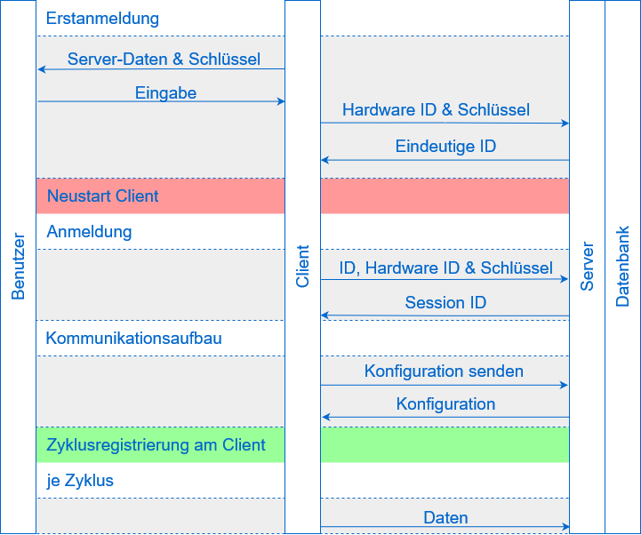

# Task Monitor
## Inhaltsverzeichnis
1. [Grundaufbau](#1-grundlegendes)
2. [Client](#2-client)
   1. [OSHI](#i-client---oshi)
   2. [Informationen](#ii-client---informationen)
   3. [Zyklus](#iii-client---zyklen)
3. [Grundablauf Client-Server](#3-grundablauf-client-server)
   1. [Erstanmeldung](#i-grundablauf-client-server---erstanmeldung)
   2. [Anmeldung](#ii-grundablauf-client-server---anmeldung)
   3. [Kommunikationsaufbau](#iii-grundablauf-client-server---kommunikationsaufbau)
   4. [Zyklen](#iv-grundablauf-client-server---zyklen)
   5. [Zusammenfassung](#v-grundablauf-client-server---zusammenfassung)
4. [Datenbank](#4-datenbank)

## 1. Grundlegendes 
Der Task Monitor besteht aus drei Hauptkomponenten
- Client
- Server
- Web-Server

Zusätzlich wird noch eine Datenbank benötigt, in der alle nötigen Informationen abgespeichert werden können.

Hierzu liest der Client in regelmäßigen Abständen Informationen aus und sendet diese an den Server,
der die Informationen in die Datenbank schreibt. Der Web-Server zeigt die in der Datenbank gespeicherten Daten dann
grafisch aufbereitet als http(s) server an. Des Weiteren soll der Server Daten filtern und diese unter gewissen Umständen 
(z.B. hohe CPU oder RAM Auslastung) als kritisch markieren. Sollten bei einem Client in einer gewissen Zeit
viele kritische Daten erkannt werden, wird der gesamte Client als kritisch angezeigt.


> Bild: Grundaufbau Kommunikation

## 2. Client
Der Client bekommt über zwei Arten Informationen
1. JVM (Java Standard Bibliotheken) und
2. OSHI


> Bild: Java-Architektur Client

### i. Client - OSHI
[OSHI Auf Github](https://github.com/oshi/oshi)

OSHI steht für Operating System and Hardware Information, es ist eine API die auf [Java Native Access (JNA)](https://github.com/java-native-access/jna) basiert.
Die API unterstützt
- macOS,
- Linux,
- Windows,
- Solaris,
- FreeBSD
- OpenBSD,
- WindowsCE,
- AIX,
- Android,
- GNU,
- kFreeBSD und
- NetBSD.

Dabei wendet die API unter anderem JNA an, um eigene native Methoden in Java einzufügen.
Dies bedeutet, dass die Informationen direkt auf Betriebssystem-Ebene Abgefragt werden,
was zum einen den nachteil hat, dass die API Betriebssystem abhängig ist, jedoch auch den Vorteil,
dass die Einschränkungen der JVM umgangen werden können und es somit möglich ist mehr Daten abzufragen.
Einige Informationen werden jedoch auch ohne JNA durch JVM Standards (Dateien lesen, ENV-Abfragen, ...) bereitgestellt.

### ii. Client - Informationen
<details>
  <summary>Allgemeine Informationen</summary>

Allgemeine Informationen sind Information, die sich wären des laufenden Betriebes nicht oder selten ändern.
Diese beinhalten:
- Hostname
- Mainboard
  - Hersteller
  - Model
  - Hardware UID
- Firmware/BIOS
  - Name
  - Version
  - Hersteller
  - Veröffentlichungsdatum
- CPU
  - Kennung
    - Hersteller
    - Name
    - Famille
    - Model
    - Stepping
    - Prozessor Id
    - 64 Bit
    - Mikroarchitektur
  - Frequenz
  - Kerne
  - Threads
- Hauptspeicher
  - Kapazität
  - Page Anzahl
  - Swap Kapazität
  - Virtuelle Kapazität
  - Physisch (je Stick)
    - Steckplatz
    - Kapazität
    - Frequenz
    - Hersteller
    - Typ
- Sekundärspeicher (je Festplatte)
  - Name
  - Model
  - Kapazität
  - Partition (je Partition auf Festplatte)
    - Identifikation
    - Typ
    - UUID
    - Kapazität
    - Einbindepunkt
- GPU (je GPU)
  - Name
  - Hersteller
  - VRam
- Netzwerkschnittstellen (je Schnittstelle inkl. lokale)
  - Name
  - Anzeigename
  - Schnittstellenalias
  - Maximal Übertragungseinheit
  - Mac Adresse
  - IPv4 Adressen (je Adresse)
    - Adresse
    - Subnetmask
  - IPv6 Adresse (je Adresse)
    - Adresse
    - Prefix
  - Geschwindigkeit
- Netzteile (je Netzteil)
  - Name
- Soundkarten
  - Name
  - Codec
- USB-Geräte
  - Name
  - Hersteller
  - ProduktId
  - SerialId
  - Angeschlossene USB-Geräte (je Gerät, USB-Gerät)
- Betriebssystem
  - Familie
  - Hersteller
  - Version
  - Codec
  - Buildnummer 
- Internet
  - DNS (je Eintrag)
  - IPv4 Standartgateway
  - IPv6 Standartgateway
- Filesystem
  - Maximale Anzahl Datei Deskriptoren
  - Dateispeicher (je Dateispeicher)
    - Name 
    - Volumen
    - Lable
    - Mount
    - Beschreibung
    - Typ
    - Kapazität
- Benutzer (je angemeldetem Benutzer) (möglich, Administrator rechte?)
  - Name
  - Host
  - Terminal
  - Loginzeit
</details>

<details>
  <summary>Zyklische Informationen</summary>

Zyklische Informationen sind Information, die sich wären des Betriebes laufend ändern.
Zu jeder Information über eine Komponente wird noch eine Id hinzugefügt, über die eine eindeutige zuteilung möglich ist.
Diese beinhalten:
- CPU
  - Auslastung
  - Kontextänderungen
  - Unterbrechungen
  - Temperatur
- Hauptspeicher
  - Benutzt
  - Swap Benutzt
  - Virtuell Benutzt
  - Page In
  - Page Out
- Sekundärspeicher (je Festplatte)
  - Warteschlangenlänge
  - Leseoperationen
  - Gelesene Bytes
  - Schreiboperationen
  - Geschriebene Bytes
  - Übertragungszeit
- Netzwerkschnittstellen (je Schnittstelle inkl. lokale)
  - Empfangene Bytes
  - Gesendete Bytes
  - Empfangene Pakete
  - Gesendete Pakete
  - Eingehende Fehler
  - Ausgehente Fehler
  - Kollisionen
- Betriebssystem
  - Prozesse
  - Threads
  - Betriebszeit
- Prozesse
  - ID
  - Name
  - Pfad
  - Befehl
  - Argumente
  - Umgebungsvariablen
  - Arbeitsverzeichnis
  - Benutzer
  - Benutzer ID
  - Gruppe
  - Gruppen ID
  - Status
  - Elternprozess ID
  - Priorität
  - Virtuelle Größe
  - Resistente Größe
  - CPU Zeit
  - Benutzer Zeit
  - Startzeit
  - Gelesen bytes
  - Geschrieben bytes
  - Geöffnete Dateien
  - Kumulierte Prozessorlast
  - Kleine Fehler
  - Große Fehler
  - Kontext änderungen
  - Threads
  - Threads (je benutzen Thread)
    - ID
    - Name
    - Status
    - Kumulierte Prozessorlast
    - Beginnende Hauptspeicheradresse
    - Kontext änderungen
    - Kleine Fehler
    - Große Fehler
    - CPU Zeit
    - Benutzer Zeit
    - Startzeit
    - Priorität
- Services
  - Prozess ID
  - Name
  - Status
- Fenster (nur GUI Betriebssysteme)
  - ID
  - Title
  - Command
  - Position
    - x
    - y
    - Höhe
    - Breite
  - Prozess
  - Anordnung
  - Sichtbar
- Internet
  - Stats
    - TCPv4/6
      - Aufgebaute Verbindungen
      - Aktive Verbindungen
      - Passive Verbindungen
      - Verbindungsfehler
      - Zurückgesetzte Verbindungen
      - Gesendete Segmente
      - Erhaltene Segmente
      - Erneut gesendete Segmente
      - Ausgehente Zurücksetzungen
      - Eingehende Fehler
    - UPDv4/6
      - Datagrame gesendet
      - Datagrame erhalten
      - Datagrame ohne Port
      - Fehlerhafte erhaltene Datagrame
  - Verbindungen (je offener TCP Verbindung)
    - Typ
    - lokale Adresse
    - lokaler Port
    - fremde Adresse
    - fremder Port
    - Status
    - Sendewarteschlange
    - Empfangswarteschlange
    - Besitzender Prozess
- Filesystem
  - Derzeitige Anzahl Datei Deskriptoren
  - Dateispeicher (je Dateispeicher)
    - Freie Kapazität
    - Benutzbare Kapazität
</details>

### iii. Client - Zyklen
Ist der Client gestartet Arbeitet dieser in Zyklen. Wobei je Zyklus durchlauf Aktionen ausgeführt werden können.
Aktionen können auch eine gewisse Anzahl an Zyklen arbeiten (z. B.: jeder 5 Zyklus).
Hierfür wird eine API bereitgestellt.

```java
class CycleExample {

  public void cycleExample(CycleManager cycleManager) {
    cycleManager.registerEveryCycle(() -> System.out.println("Jeder Zyklus"));
    cycleManager.registerCycle(5, () -> System.out.println("Jeder 5 Zyklus"));
    cycleManager.start(1000); // Starten mit 1000ms abstand je Zyklus (= 1s)
    cycleManager.stop();
  }

}
```
> Auszug: Methoden Zyklus manager


## 3. Grundablauf Client-Server
Client und Server kommunizieren über eine HTTP Verbindung miteinander.

### i. Grundablauf Client-Server - Erstanmeldung

[//]: # (TODO: Link zu Webpanel)

Beim ersten start des Clients werden die Verbindungsdaten zum Server abgefragt und in einer Konfiguration gespeichert.
Des Weiteren muss über das Webpanel ein Schlüssel generiert werden, der für den ersten start des Clients benötigt wird.
Danach erfolgt die Erstanmeldung beim Server, dieser übermittelt dem Client eine eindeutige ID
und verbindet diese mit dem Schlüssel und der Hardware ID.
Hierdurch können Clients auch nach Restart oder änderung des Hostname identifiziert werden.
Danach können ID, Hardware ID und Schlüssel nur noch in kombination verwendet werden.

### ii. Grundablauf Client-Server - Anmeldung

Bei jeder weiteren Anmeldung werden zuerst ID, Hardware ID und Schlüssel an den Server übermittelt.
Der Server geniert dann ein Session-Token, mit dem sich der Client bei jeder weiteren Anfrage verifiziert (Header).

### iii. Grundablauf Client-Server - Kommunikationsaufbau
Um die Kommunikation mit dem Server aufzubauen, fragt der Client zuerst die Konfiguration ab.
Die Konfiguration beinhaltet
- Abstand je Zyklus,
- Allgemeine Informationen und
- Zyklische Informationen.

Der Abstand je Zyklus gibt an, wie viel Millisekunden zwischen zwei Zyklen vergeht.

Die allgemeinen Informationen geben an, welche allgemeinen Informationen am begin übermittelt werde sollen
und in welchem zyklischen Abstand diese erneut überprüft werden sollen.

Die zyklisch Informationen beinhalten, welche Informationen zu welchen zyklen an den Server gesendet werden sollen.

### iv. Grundablauf Client-Server - Zyklen
Nach dem [Kommunikationsaufbau](#iii-grundablauf-client-server---kommunikationsaufbau) wird für jede
Aktion ein Zyklus registriert. Sollten mehrere Aktionen den selben Zyklus abstand haben,
wird dies mit einem Zyklus realisiert.

In diesem Zyklus werden nun
1. änderungen an allgemeinen Informationen und
2. der Status von zyklischen Informationen

abgefragt und an den Server gesendet.

### v. Grundablauf Client-Server - Zusammenfassung



> Bild: Zusammenfassung Grundablauf Client-Server

# 4. Datenbank

Alls Datenbank sollte [SurrealDB](https://surrealdb.com/) verwendet werden.
Jedoch existiert dafür derzeit kein Java Driver, sollte dieser bis zum Beginn der Datenbankanbindung nicht vorhanden sein,
muss auf den [Websocket](https://surrealdb.com/docs/integration/websockets) zugegriffen werden.
